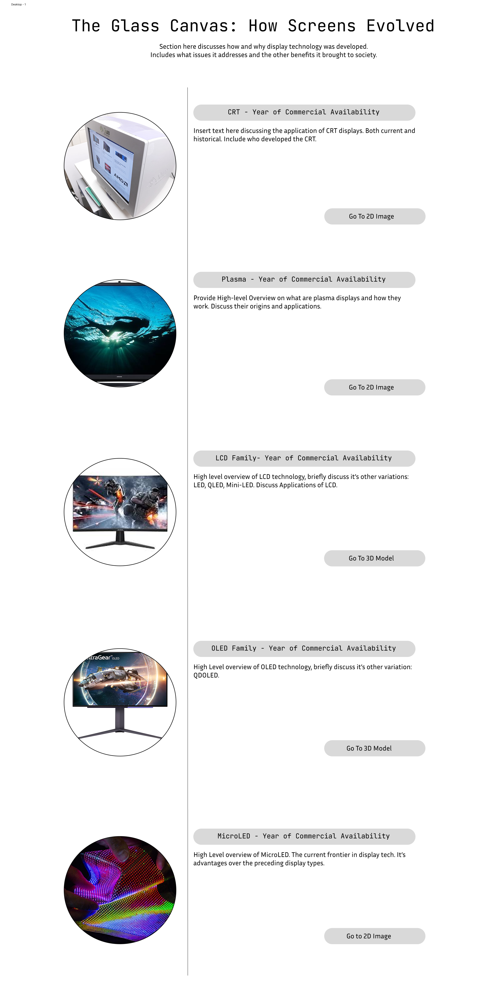
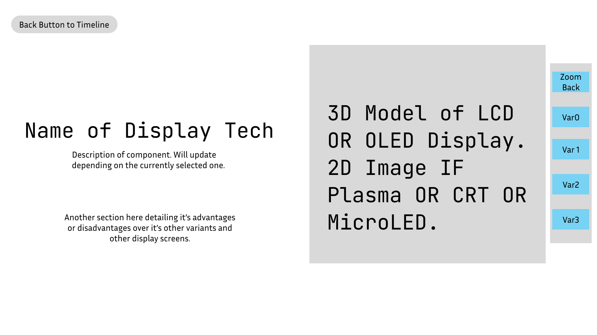

# 🖥️ The Glass Canvas: How Screens Evolved

---

## 👥 Group Members (Group 7)
*   **DE LEON, SOFIA YSABELA**
*   **GALVEZ, ANOUSHEH MONICK ROBENIOL**
*   **GUILLERMO, IAIN DRAEZEN SY**
*   **LEE, ASHLEY FIONA SANTOS**
*   **TIU, AVRAM NATHANIEL PAGUNTALAN**

## 🎯 Group Theme
**Understanding different display technologies and how they produce images on screen.** 

## 🛠️ Tech Stack

*   **Astro**: Project structure skeleton and optimized routing.
*   **React**: Interactive UI components and state management.
*   **MDX**: Dynamic, component-driven educational content.
*   **React Three Fiber & Drei**: High-performance 3D rendering and helper utilities for browser-based interaction.

---

## 📝 Project Description
An interactive educational platform designed to help users understand the different types of displays developed and how its components work together to deliver visuals to us. The platform covers key components such as why display screens were developed, the uses of each display type, and comparing them to each other. Users can explore detailed explanations, interactive visualizations, and dynamic content that demonstrate the role of each component and how the components work together to produce light and process it to produce images. The project is built using Astro for the application structure, React for interactive user interfaces, MDX for content-driven learning experiences, React Three Fiber (R3F) for 3d models, and Drei as a collection of helper functions for R3F.

---

## 🗺️ Exhibit Navigation
The platform is organized into the following logical sections:

1.  **Rationale**: Discusses why display technology was developed and what needs did it address.
2.  **Timeline**: A user will be presented with a long scroll timeline to choose which display tech they wish to learn more about. Each entry in the timeline will provide a year on when the screen became commercially available to the public along with a high-level overview on how each display type works and their applications.
3.  **The Cathode Ray Tube**: Discuss what a cathode ray tube is, its parts, and how it works. This section will also show its advantages and limitations, along with its applications in the past and present.
4.  **Plasma**: Similar to the Cathode Ray Tube, its origins, applications, and inner workings will be discussed. Will also cover its early and late use during its era along with its decline.
5.  **LCD Family**: Will mainly focus on its core principles of a liquid crystal layer, having two polarizing light filters, susceptibility to light bleed, power delivery, backlighting, and how the other variations either replace some of the components or build on top of it.
6.  **OLED Family**: Exploring its application in consumer electronics, IoT, embedded systems, industrial, and automotive.
7.  **MicroLED**: Currently an in development display screen type. Combines the strengths of LCD and OLED type screens.

---

## 🕹️ Interactive Elements

### 3D Component Explorer
*   Component descriptions will be displayed accordingly depending on the component the user clicks on the 3d model.
*   User can rotate the 3d model.
*   Shows animations to simulate how light passes from its source and is processed into colors.
*   Paragraph description next to the 3d model. Will update depending on the currently selected component.
*   The model should automatically zoom in. To the component the user wishes to know more about.

---

## 📖 Exhibition Content Outline

### Introduction
*   $\color{lightgreen}{\textbf{**The Rationale**: Why display screens were developed and the fundamental human need for visual data interfaces.}}$
*   **The Timeline**: The evolutionary leap from analog tubes to microscopic LEDs.

### Legacy Display Technologies
*   **The Cathode Ray Tube (CRT)**: Principles of electron guns, vacuum tubes, and phosphor interaction.
*   **Plasma Displays**: The transition to flat panels using noble gases, UV light, and individual pixel cells.

### The LCD Architecture
*   **Liquid Crystal Displays (LCD)**: The mechanics of polarizing filters, liquid crystal layers, and backlight transmission.
*   **Improvements Overtime**: Rise of LED for backlight transmission, local dimming with MiniLED, and the quantum dot layer with QDLED.

### Modern & Emerging Innovations
*   **The OLED Family**: The shift to self-emitting pixels, organic compounds, and the elimination of backlights.
*   **MicroLED**: The synthesis of LCD and OLED strengths, utilizing microscopic LEDs for unparalleled brightness and contrast.

---

## 📷 Tentative Style Guide Snapshot

